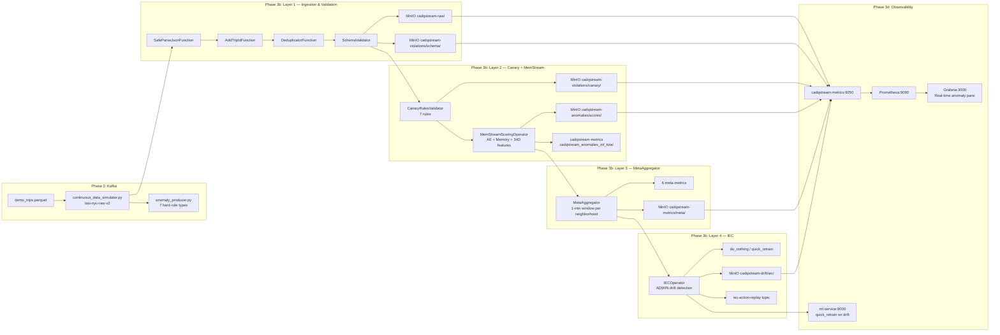

# CA-DQStream Production Deployment — Part 2: Verification & Testing

## Phase 3: End-to-End Verification (Layer by Layer)

### 3a. Kafka — Producer already running, verify flow
The `kafka-producer` service started automatically with `docker compose up -d` (volume mount: `../data:/data:ro` pointing to `deployment/data/`). Verify the demo parquet is mounted correctly.

If the demo file is at a different path, update `kafka-producer` environment:
```bash
docker compose -f deployment/docker-compose.yml stop kafka-producer
# Fix INPUT_FILE in docker-compose.yml, then:
docker compose -f deployment/docker-compose.yml up -d kafka-producer
```

Verify `taxi-nyc-raw-v2` has records via Kafka UI (`http://localhost:8080`).
Verify `dq-stream-unified` is receiving records with `_event_type` tags.

### 3b. Flink — Layer-by-Layer Pipeline
1. Open Flink Dashboard (`http://localhost:8081`)
2. Verify job "CA-DQStream Sequential Pipeline - Phase 3" is RUNNING
3. Check each operator's metrics:
   - **L1**: `cadqstream_records_valid_total{layer="L1"}` increasing
   - **L2 Canary**: `cadqstream_anomalies_canary_total` capturing hard-rule violations
   - **L2 MemStream**: `cadqstream_anomalies_ml_total` scoring records
   - **L3 MetaAggregator**: windowed meta-metrics being emitted
   - **L4 IEC**: `cadqstream_iec_strategies_total` with drift decisions

### 3c. MinIO — Data Sinks
1. Open MinIO Console (`http://localhost:9001`)
2. Verify each bucket has data:
   - `cadqstream-raw/` — valid trips stored
   - `cadqstream-violations/schema/` — L1 schema failures
   - `cadqstream-violations/canary/` — L2 canary violations
   - `cadqstream-anomalies/scores/` — ML anomaly scores with `anomaly_score`, `is_anomaly`, `threshold`
   - `cadqstream-metrics/meta/` — windowed meta-metrics JSON
   - `cadqstream-drift/iec/` — IEC decisions
   - `cadqstream-drift/alerts/` — alerts on drift detection

### 3d. Prometheus — Metrics Collection
1. Open Prometheus (`http://localhost:9090`)
2. Query `cadqstream_records_input_total` — should be increasing
3. Query `cadqstream_anomalies_canary_total` — should show per-rule counts
4. Query `cadqstream_anomalies_ml_total` — should show per-neighborhood ML detections
5. Verify all 8 scrape targets are UP in Status > Targets

### 3e. Grafana — Dashboard Verification
Open `http://localhost:3000` (admin / GRAFANA_PASSWORD). Check each dashboard pane:

**Pipeline Overview** — verify all 4 layers have flowing data:
- Kafka consumer lag = 0 or decreasing
- L1 records: green trending up
- L2 Canary violations: counter increasing for rules (L1, L2, L3, L4, L5, L6, L7)
- L2 ML branch: anomaly score distribution

**CA-DQStream Data Quality** — verify all required panes:
- Must show: valid records, canary violations, ML anomalies (3 panels minimum)
- Check each pane has data, not "No data"

**MemStream Data Quality** — verify:
- Warmup completion indicator (is_warmup transitions from true to false)
- Anomaly rate per neighborhood
- KNN distance distribution

**CA-DQStream ML Service** — verify:
- `ml_service_model_loaded = 1`
- `ml_service_inference_latency_seconds` histogram with data
- Redis connected, MinIO connected indicators

---

## Phase 4: Anomaly Injection & Real-Time Detection Test

### 4a. Inject anomalies from `deployment/kafka/anomaly_producer.py`
Run in **continuous** mode to stream synthetic anomalies into Kafka alongside the demo data. Adjust producer rate for visibility: slow it down so anomalies are visible on Grafana (~1 anomaly per second, not 200 records/sec):
```bash
cd /c/proj/ldt/deployment
# Run anomaly producer with slow rate for demo visibility
python kafka/anomaly_producer.py --bootstrap kafka:9092 --mode continuous
```
Or use **burst** mode to inject a spike of anomalies at once for dramatic visualization:
```bash
python kafka/anomaly_producer.py --bootstrap kafka:9092 --mode burst --burst-count 50
```

### 4b. MemStream Detection Verification
1. Query Prometheus for ML anomaly detections:
   ```promql
   cadqstream_anomalies_ml_total{layer="L2"}
   ```
2. Check MinIO anomaly scores bucket — records with `is_anomaly: true` and `anomaly_score > threshold`
3. Check MemStream warmup is complete: `is_warmup` should be `false` after 8,192 records

### 4c. Verify complete scenario chain (10 anomaly types)
| # | Type | Detection Layer | Verification |
|---|---|---|---|
| 1 | short_expensive | MemStream (L2 ML) | `cadqstream-anomalies/scores/` — high `anomaly_score` |
| 2 | tip_anomaly | MemStream (L2 ML) | `cadqstream-anomalies/scores/` — high `anomaly_score` |
| 3 | combo_short_long | MemStream (L2 ML) | `cadqstream-anomalies/scores/` — high `anomaly_score` |
| 4 | invalid_zone | L1 Schema | `cadqstream-violations/schema/` |
| 5 | negative_fare | L2 Canary | `cadqstream-violations/canary/` |
| 6 | zero_passenger | L2 Canary | `cadqstream-violations/canary/` |
| 7 | impossible_speed | L2 Canary | `cadqstream-violations/canary/` |
| 8 | missing_field | L1 Schema | `cadqstream-violations/schema/` |
| 9 | extreme_fare | L2 Canary | `cadqstream-violations/canary/` |
| 10 | zero_distance_with_fare | L2 Canary | `cadqstream-violations/canary/` |

### 4d. Grafana Real-Time Visualization (CRITICAL SUCCESS CRITERION)
Target dashboard: **CA-DQStream Data Quality** (`http://localhost:3000/d/cadqstream-dq`).
Target pane: **"ML Anomaly Score"** or **"Anomaly Detection Rate"** — query `cadqstream_anomalies_ml_total` with rate aggregation.

**Test sequence:**
1. Start anomaly producer in burst mode (50 anomalies)
2. Open Grafana dashboard, set time range to "Last 5 minutes" with auto-refresh
3. **Observe the pane update in real time** — the spike in ML-detected anomalies must be visible within seconds
4. Confirm the full chain: Kafka → Flink → MemStream → cadqstream-metrics → Prometheus → Grafana

If the pane shows "No data":
- Check Prometheus query: `cadqstream_anomalies_ml_total` should have values
- Check the pane's PromQL query matches the metric name exactly
- Check scrape target `cadqstream-app` is UP in Prometheus targets page

---

## Phase 5: MemStream Model Integration in Flink (Production Path)

The MemStream model (`models/memstream/memstream_checkpoint_v1.pt`) is integrated into the Flink pipeline via `src/operators/memstream_scoring_operator.py`:

1. **Model loading**: On operator startup, loads checkpoint from MinIO `ml-models/` bucket with HMAC verification
2. **Feature extraction**: `MemStreamVectorizer` transforms each taxi record into a 34D vector
3. **Scoring**: Autoencoder encodes → L1 kNN against 8,192 memory buffer → ContextBeta normalization
4. **Decision**: If `score / beta >= 1.0` → ANOMALY, written to `cadqstream-anomalies/scores/` + `dq-stream-unified` as `ANOMALY_RECORD`
5. **Retrain**: IEC detects drift → action-replay-worker calls `POST /api/strategy/quick_retrain` → ml-service fine-tunes model → saves new checkpoint to MinIO → broadcasts to `memstream-model-updates`

**Pre-conditions for production to work:**
- `MEMSTREAM_MODEL_SIGNING_KEY` and `IEC_SIGNING_KEY` must be set in `.env`
- `models/memstream/memstream_checkpoint_v1.pt` must exist and be accessible
- Warmup phase (8,192 records) must complete before ML scoring begins

---

## Verification Checklist

| Check | Method | Success Criteria |
|-------|--------|-----------------|
| Kafka topics | Kafka UI `http://localhost:8080` | All 6 topics exist, `taxi-nyc-raw-v2` has records |
| Flink job | Flink Dashboard `http://localhost:8081` | Job RUNNING, no failures |
| Flink checkpointing | Flink REST API | Last checkpoint timestamp recent |
| MemStream warmup | Flink logs or cadqstream-metrics | Warmup complete, `is_warmup = false` |
| MinIO buckets | MinIO Console `http://localhost:9001` | All 9 buckets with data |
| Prometheus targets | Prometheus `http://localhost:9090/targets` | All 8 targets UP |
| Grafana dashboards | Grafana `http://localhost:3000` | All panes with flowing data (L1-L4 visible) |
| Anomaly detection | Grafana real-time pane | ML anomaly spike visible within seconds of injection |
| IEC drift | Prometheus query `cadqstream_iec_strategies_total` | Counter increasing |
| ML service | `curl http://localhost:8000/health` | `model_loaded: true`, Redis connected |

---

## End-to-End Data Flow (Mermaid)


